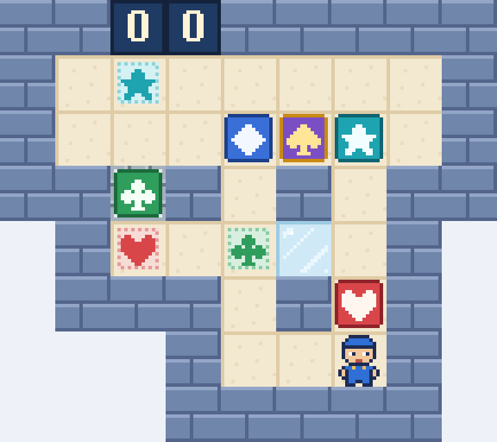

# La Baraja Imposible

Un almacén pequeño y un reto enorme: cinco cajas de cinco palos (corazón, trébol, diamante, pica y estrella),
una casilla de hielo y una vía en T. Juego web autónomo en **PuzzleScript Next**, con pixel-art 16-bit propio y
tarjetas ilustradas con todas las reglas.

**▶ Jugar:** https://spyder-cripto.github.io/la-baraja-imposible/

## Cómo se juega
- **Objetivo:** lleva cada caja a la diana de su palo. Una caja en su diana se vuelve de oro.
- **Flechas:** mover · **Z:** deshacer · **R:** reiniciar.
- **Contador de pasos:** empieza con dos cifras; la tercera aparece a los 100 pasos y la cuarta a los 1000.
- **En el móvil:** desliza el dedo para moverte; deshacer y reiniciar están en la pestaña del borde izquierdo.
- Se empuja una sola caja cada vez y no se puede tirar de ellas.
- **Hielo:** lo que lo pisa sigue deslizando hasta salir a suelo firme (un solo paso).
- **Vía en T:** las cajas solo entran y salen por la izquierda, la derecha y arriba; el mozo pasa libre.
- Dentro del juego, el botón **«Cómo se juega»** abre las tarjetas con las reglas y las piezas.

**Récord: 727 pasos**, y es el mínimo: una búsqueda exhaustiva por ordenador de todas las posiciones del nivel
(más de 69 millones) no encuentra ninguna solución más corta. ¿Lo igualas?

## Créditos
- Recreación, arte 16-bit y tarjetas: **Spider** (Fali + Claude), 2026
- Nivel original: kjs722 («Impossible #5», sokobanonline.com, 2020)
- Motor: [PuzzleScript Next](https://github.com/david-pfx/PuzzleScriptNext) (derivado de PuzzleScript de increpare), incrustado en un único `index.html`
- Fuente del juego: [`juego.txt`](juego.txt)
